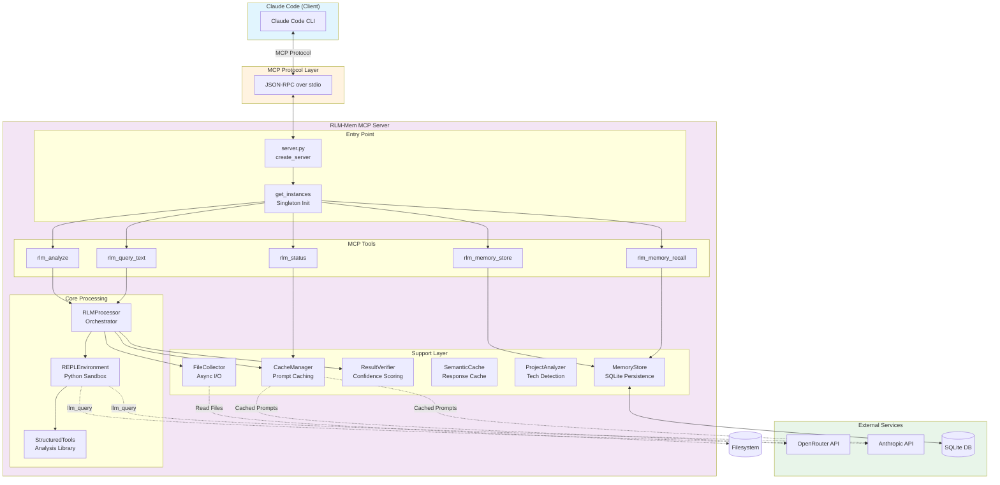
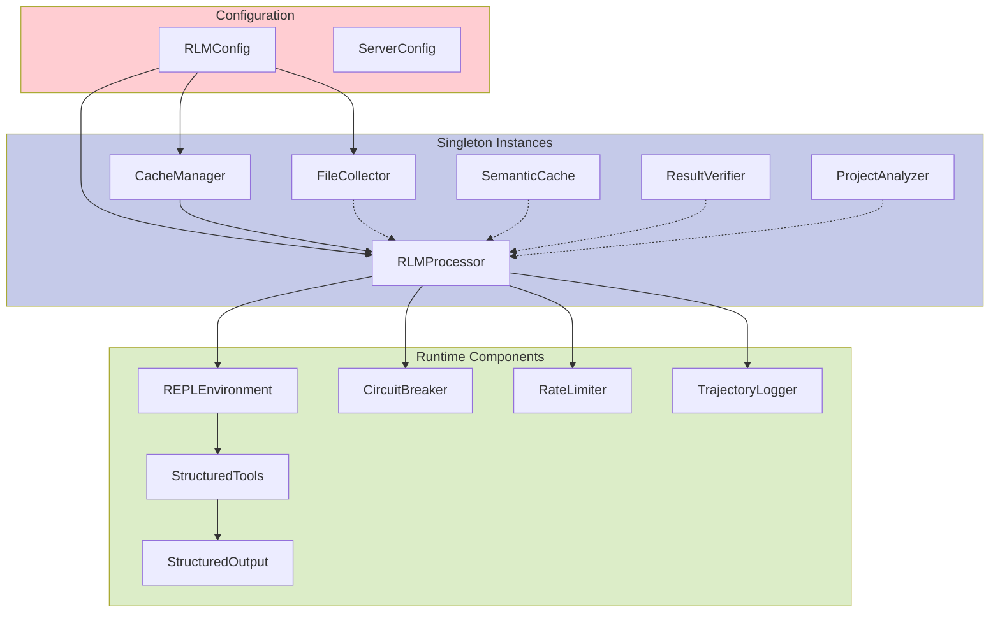
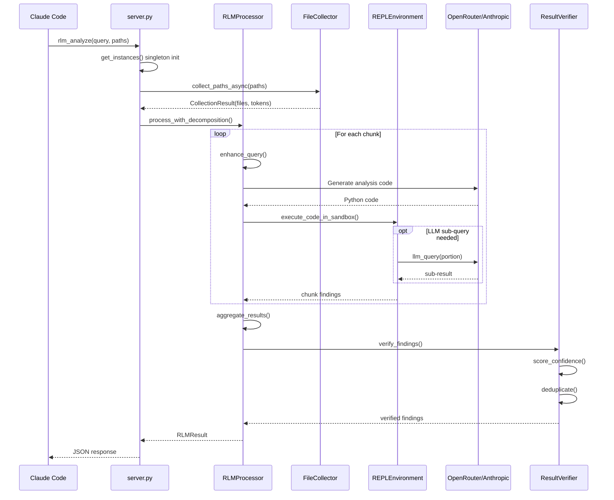
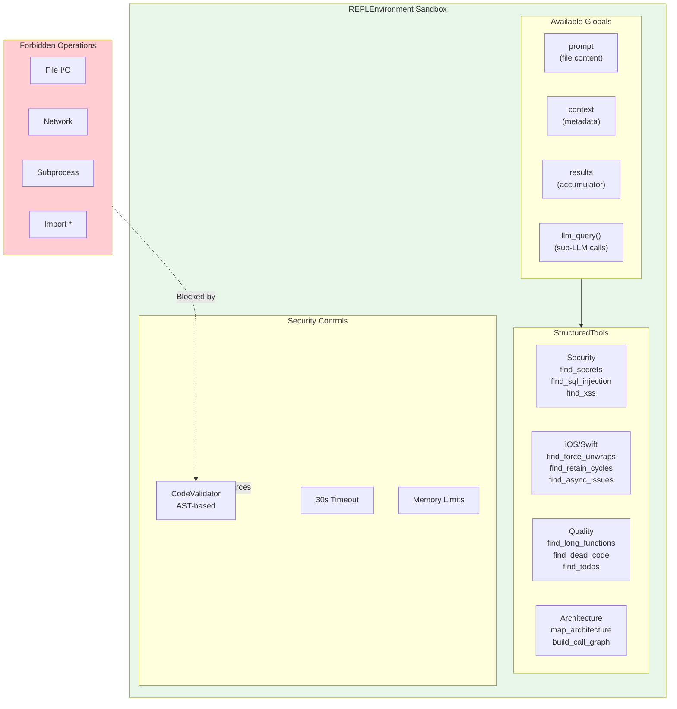
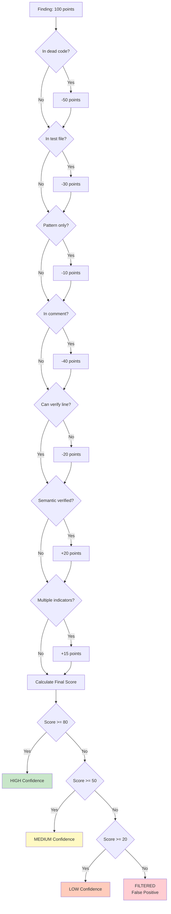
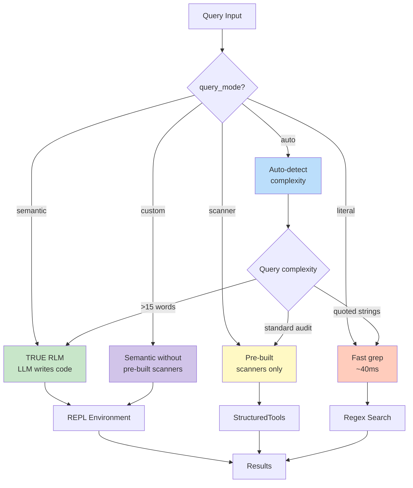
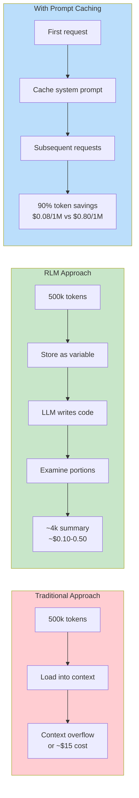

# RLM-Mem MCP Server - System Architecture

## High-Level System Flow



## TRUE RLM Processing Pipeline

```mermaid
flowchart LR
    subgraph Input["1. Input"]
        Q[Query]
        P[Paths]
    end

    subgraph Collection["2. Collection"]
        FC2[FileCollector]
        FILTER[Extension Filter]
        SKIP[Skip Dirs Filter]
    end

    subgraph Processing["3. TRUE RLM Processing"]
        direction TB
        STORE["Store as Variable<br/>(prompt = content)"]
        CODE["LLM Writes Python<br/>to examine prompt"]
        EXEC["Execute in Sandbox<br/>with llm_query()"]
        VARS["Results stored<br/>as variables"]
    end

    subgraph Verification["4. Verification"]
        RV2[ResultVerifier]
        CONF[Confidence Scoring]
        DEDUP[Deduplication]
    end

    subgraph Output["5. Output"]
        JSON[Structured JSON]
        MD[Markdown Report]
    end

    Q & P --> FC2
    FC2 --> FILTER --> SKIP
    SKIP --> STORE
    STORE --> CODE
    CODE --> EXEC
    EXEC --> VARS
    VARS -.->|iterate| CODE
    VARS --> RV2
    RV2 --> CONF --> DEDUP
    DEDUP --> JSON & MD

    style Input fill:#bbdefb
    style Collection fill:#c8e6c9
    style Processing fill:#fff9c4
    style Verification fill:#ffccbc
    style Output fill:#d1c4e9
```



## Component Dependency Graph



## Data Flow: rlm_analyze Request



## REPL Sandbox Environment



## Confidence Scoring Algorithm (L11)



## Query Mode System (v2.3)



## File Structure

```
RLM-Mem_MCP/
├── python/
│   ├── src/rlm_mem_mcp/
│   │   ├── server.py           # MCP server entry point
│   │   ├── rlm_processor.py    # Core RLM orchestrator
│   │   ├── repl_environment.py # Python sandbox
│   │   ├── structured_tools.py # Analysis tool library
│   │   ├── structured_output.py# Output formatting
│   │   ├── file_collector.py   # Async file I/O
│   │   ├── cache_manager.py    # Prompt caching
│   │   ├── result_verifier.py  # Confidence scoring
│   │   ├── memory_store.py     # SQLite persistence
│   │   ├── semantic_cache.py   # Response caching
│   │   ├── project_analyzer.py # Tech stack detection
│   │   └── config.py           # Configuration
│   └── tests/
├── CLAUDE.md                   # Project documentation
└── .mcp.json                   # MCP config
```

## Cost Optimization Flow



---

*Generated from RLM analysis of 54 files (~223k tokens)*
